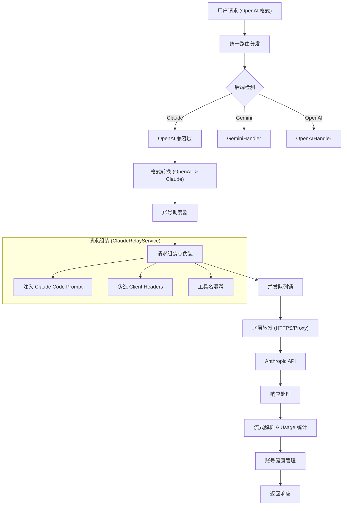

# Claude Relay Service API 转发流程深度解析

本文档详细解析了 `Claude Relay Service` 处理 API 请求的完整流程。该服务核心目标是提供 OpenAI 格式兼容接口，同时通过伪装成 Anthropic 官方 CLI 工具 (`Claude Code`) 来优化访问体验，并利用多账号池实现高可用负载均衡。

## 1. 核心流程概览

整个请求处理链路遵循以下路径：

## 2. 详细步骤分析

### 2.1 入口与路由分发 (Routing)
*   **入口文件**: [unified.js](../src/routes/unified.js)
*   **逻辑**:
    *   所有请求首先进入 `/v1/chat/completions`。
    *   `routeToBackend` 函数解析请求体中的 `model` 字段。
    *   根据模型前缀（如 `claude-`、`gemini-`、`gpt-`）将请求分发到对应的处理逻辑。对于 Claude 模型，请求被路由到 `handleChatCompletion`。

### 2.2 格式转换 (Format Conversion)
*   **处理文件**: [openaiClaudeRoutes.js](../src/routes/openaiClaudeRoutes.js)
*   **转换服务**: [openaiToClaude.js](../src/services/openaiToClaude.js)
*   **关键动作**:
    *   **参数映射**: 将 OpenAI 的 `messages`、`tool_calls` 等字段转换为 Anthropic API 格式。
    *   **System Prompt 策略**: 默认情况下，转换器会强制注入 `"You are Claude Code, Anthropic's official CLI for Claude."` 作为 System Prompt。这是伪装成官方 CLI 工具的第一步。
    *   **Xcode 特殊处理**: 如果检测到请求来自 Xcode（包含特定标识），则保留 Xcode 的 System Prompt，不做覆盖。

### 2.3 账号调度 (Account Scheduling)
*   **调度服务**: `src/services/unifiedClaudeScheduler.js`
*   **策略**:
    *   **负载均衡**: 从活跃账号池中选择负载最低的账号。
    *   **Sticky Session (会话粘性)**: 利用请求特征生成 Session Hash，尽量让同一会话的请求落在同一个账号上，保持上下文缓存（Context Caching）的高效利用。
    *   **权限与黑名单**: 过滤掉被标记为 `Blocked`、`RateLimited` 或 `Unauthorized` 的账号。

### 2.4 请求组装与伪装 (Assembly & Masquerading)
这是核心逻辑所在，位于 [claudeRelayService.js](../src/services/claudeRelayService.js)。

#### A. 请求体深度加工 (`_processRequestBody`)
1.  **强制伪装**: 再次检查 System Prompt，确保 `Claude Code` 的 Prompt 存在且位于首位（除非是真实的 Claude Code 请求）。
2.  **Token 限制**: 读取 `model_pricing.json`，动态调整 `max_tokens` 以防止超出模型限制。
3.  **缓存控制清洗**: 移除 Anthropic API 不支持的 `cache_control.ttl` 字段，并限制 `cache_control` 块的数量（最多 4 个），防止 API 报错。

#### B. Header 伪造 (`_prepareRequestHeadersAndPayload`)
1.  **Header 继承**: 获取选中账号保存的 `Claude Code` 专用 Headers（例如特定的 `User-Agent`、`Cookie` 等），覆盖当前请求的 Headers。
2.  **指纹伪造**: 构造 `User-Agent`，通常伪装成 `claude-cli/1.0.xxx`。
3.  **Beta 特性激活**: 根据请求的模型动态计算 `anthropic-beta` Header。
    *   例如：Haiku 模型会添加 `oauth-2025-04-20`。
    *   其他模型会添加 `claude-code-20250219` 等，以解锁特定的 API 能力。

#### C. 工具名混淆 (`_transformToolNamesInRequestBody`)
*   为了规避潜在的风控特征检测，服务支持将 Tool 名称随机化或转换为 PascalCase。
*   服务内部维护映射表，在发送请求前修改 Tool 定义和调用，在收到响应后还原，对用户完全透明。

### 2.5 底层转发与并发控制 (Forwarding)
*   **并发锁**: 使用 `userMessageQueueService` 获取 Redis 分布式锁，严格控制单个账号的并发请求数，防止账号被封禁。
*   **网络请求**:
    *   使用原生的 `https.request` 发送请求。
    *   **代理支持**: 通过 `_getProxyAgent` 为每个账号加载独立的代理 IP，防止 IP 关联。
*   **重试机制**: 针对 `403 Forbidden` 错误，实现了最多 2 次的自动重试机制。

### 2.6 响应处理与健康管理 (Response & Health)

#### A. 流式响应处理 (SSE)
*   服务拦截上游的 SSE 流，进行实时解析。
*   **Usage 统计**: 捕获流中的 `usage` 事件，精确统计 Input/Output Token 以及 Cache Read/Creation Token，用于计费。
*   **错误透传**: 如果流中断或返回错误 Event，将其转换为标准的 API 错误返回给客户端。

#### B. 账号健康状态机
根据响应状态码自动维护账号状态：
*   **429 (Too Many Requests)**: 读取 `anthropic-ratelimit-unified-reset` Header，精确计算重置时间，将账号标记为 `RateLimited`。
*   **401 (Unauthorized)**: 记录错误计数，连续失败后标记为 `Unauthorized`。
*   **403 (Forbidden)**: 视为严重错误，直接标记账号为 `Blocked`。
*   **529 (Overloaded)**: 标记账号为 `Overloaded`，暂时隔离一段时间。
*   **200 (OK)**: 成功请求会清除之前的临时错误计数，并更新 Session Window 状态。

## 3. 关键代码引用

*   **路由入口**: [unified.js](../src/routes/unified.js)
*   **请求转换**: [openaiToClaude.js](../src/services/openaiToClaude.js)
*   **核心服务**: [claudeRelayService.js](../src/services/claudeRelayService.js)
*   **账号调度**: `src/services/unifiedClaudeScheduler.js`
*   **并发队列**: `src/services/userMessageQueueService.js`